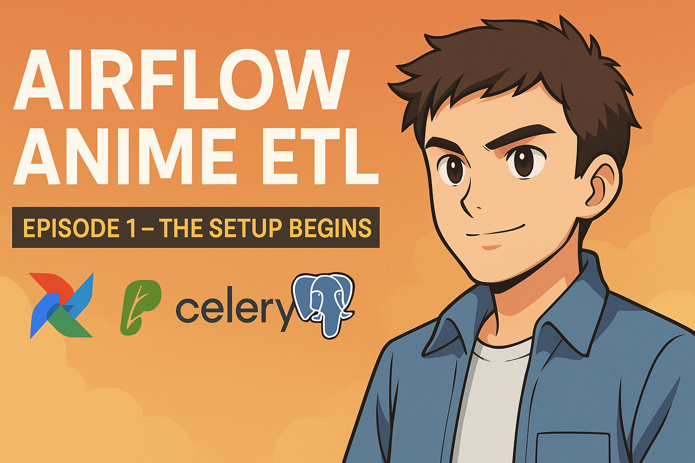

<p align="center">
  
</p>

# 🎬 Airflow Anime ETL — A Jornada de um Pipeline

> Uma série de aprendizado e construção prática, parte por parte, de um pipeline de dados real com **Apache Airflow**, **Celery**, **Redis**, **PostgreSQL** e **Docker** — tendo como tema o universo dos **animes**! 🍥⚡

---

## 🧭 Introdução

Este projeto é mais do que apenas código: é uma **jornada**.

A ideia é documentar o passo a passo da criação de um **pipeline ETL completo**, mostrando como um Engenheiro de Dados projeta, estrutura e executa cada parte de um ecossistema moderno de orquestração.

Cada parte representa uma etapa concreta do progresso — do ambiente inicial até a automação total com DAGs distribuídas.

---

## 📖 Série — A Evolução do Projeto

| Parte | Título | Status | Descrição |
|:------:|:--------|:--------:|:-----------|
| 🧩 **Parte 1** | *O Nascimento do Ambiente* | ✅ Concluída | Montagem do ecossistema Airflow com CeleryExecutor, Redis e PostgreSQL via Docker Compose. |
| ⚙️ **Parte 2** | *Primeira DAG: Extraindo o Poder dos Animes* | 🚧 Em desenvolvimento | Criação da DAG ETL para extrair dados da **Jikan API**, transformá-los em CSV e armazená-los no PostgreSQL. |
| 📊 **Parte 3** | *Da Pipeline ao Insight* | 🔜 Em breve | Conexão com dashboards e monitoramento dos dados processados (Streamlit / Grafana). |

---

## 🧩 Parte 1 — O Nascimento do Ambiente

Nesta primeira fase, o objetivo foi **erguer as fundações**: construir o ambiente completo do Airflow rodando com **CeleryExecutor** — o coração que permite o paralelismo e a escalabilidade das tasks.

### 🔧 Etapas realizadas

- Criação do diretório `airflow_anime`
- Configuração do `docker-compose.yml` com os serviços:
  - `webserver`, `scheduler`, `worker`, `flower`
  - `postgres` (banco de metadados)
  - `redis` (message broker do Celery)
- Inicialização do banco (`airflow db init`)
- Criação do usuário `admin`
- Correção de permissões e volumes
- Painel Airflow disponível em: [http://localhost:8080](http://localhost:8080)
- Painel Flower disponível em: [http://localhost:5555](http://localhost:5555)

🧠 *Resultado:* Ambiente 100% funcional, pronto para receber as DAGs da Parte 2.

---

## ⚙️ Parte 2 — Primeira DAG: Extraindo o Poder dos Animes

A segunda fase será o verdadeiro **primeiro voo do pipeline**.  
O objetivo é criar uma **DAG diária** que:

1. **Extraia** informações da [Jikan API](https://docs.api.jikan.moe/)  
   (título, episódios, nota, popularidade, data de lançamento);
2. **Transforme** os dados com `pandas`;
3. **Carregue** os resultados:
   - em `.csv` (camada raw e processed);
   - no banco **PostgreSQL** dentro do container.
4. Tudo isso, **distribuído via Celery**, com logs e monitoramento no Flower.

📦 *Stack usada:* `requests`, `pandas`, `PostgresHook`, `psycopg2`.

🔁 *Agendamento:* diário (`@daily`)

---

## 📊 Parte 3 — Da Pipeline ao Insight

A terceira parte trará o lado analítico da jornada:
- Conexão do banco ao **Streamlit** para criar dashboards interativos;
- Visualização da evolução de notas, popularidade e tendências de animes;
- (Possivelmente) alertas automáticos via Airflow.

🎯 *Objetivo:* Fechar o ciclo do dado — da extração ao insight.

---

## ⚙️ Stack técnica geral

| Componente | Função |
|-------------|--------|
| **Apache Airflow** | Orquestração das DAGs |
| **Celery** | Execução distribuída das tasks |
| **Redis** | Message Broker |
| **PostgreSQL** | Armazenamento e persistência dos dados |
| **Docker Compose** | Infraestrutura de containers |
| **Python (requests, pandas)** | Extração e transformação dos dados |
| **Jikan API** | Fonte dos dados de anime (REST pública) |

---

## 🧠 Sobre o projeto

Criado por **Takeshy Takatsu (LilKeshy)** como parte do aprendizado em **Engenharia de Dados**, unindo:
- Orquestração (Airflow)  
- Paralelismo (Celery)  
- APIs reais (Jikan)  
- Automação e monitoramento (Flower e Postgres)

📅 *Linha do tempo:*
- **Out/2025:** Parte 1 concluída ✅  
- **Out–Nov/2025:** Desenvolvimento da Parte 2  
- **Nov/2025+:** Parte 3 (visualização e deploy final)

---

## 🪄 Como rodar localmente

```bash
# Subir containers
docker compose up -d

# Inicializar Airflow (caso seja a primeira vez)
docker compose run airflow-init

# Acessar painéis
http://localhost:8080   # Airflow
http://localhost:5555   # Flower
